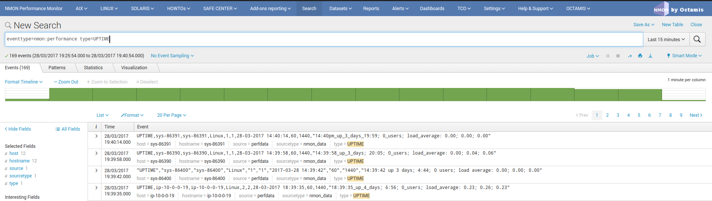

##############################
Extend Nmon with external data
##############################

Since the release 1.3.x of the TA-nmon, you can extend very easily the context of the nmon data using the nmon external scripts.

Integrating external data is an integrated feature in nmon binaries (for AIX, Linux and Solaris), and it has been integrated within the TA-nmon such that it is
even much easier to integrate anything that matters for you.

**The data can be retrieved from:**

* Any command available to the operating system
* Script of any kind that can be called within a shell script: other shell script, Python, Perl...

Basically anything you can retrieve from your systems!

==================
How does it work ?
==================

**Very simple, we start with 2 simple shell scripts involved:**

* bin/nmon_external_cmd/nmon_external_start.sh
* bin/nmon_external_cmd/nmon_external_snap.sh

**Both scripts are being called automatically by nmon binaries, using the global environment variables (set by bin/nmon_helper.sh):**

* NMON_START which equals to the full path of the nmon_external_start.sh script
* NMON_SNAP which equals to the full path of the nmon_external_snap.sh script

*An additional variable set by bin/nmon_helper.sh defines the fifo file path were to write the data (used by bin/nmon_external_cmd/*.sh script)*

.. image:: img/nmon_external_workflow1.png
   :alt: img/nmon_external_workflow1.png
   :align: center

**Then, nmon parsers will automatically load the list of nmon sections to be parsed (the "type" field in Splunk) defined in:**

* default/nmonparser_config.json (for the default configuration)
* local/nmonparser_config.json (for upgrade resilient customization)

.. image:: img/nmon_external_workflow2.png
   :alt: img/nmon_external_workflow2.png
   :align: center

==============================
Ok got it, how do I add mine ?
==============================

**Right, very simple, let's take the example of the uptime command output:**

Running the "uptime" command outputs various interesting information: server uptime, number of Unix users connected, system load for last minute, 5 minutes, 15 minutes::

 19:08:45 up 11:00,  1 user,  load average: 0.13, 0.22, 0.19

**STEP 1: header definition**

Within the "bin/nmon_external_start.sh" script, we add::

   # uptime information
   echo "UPTIME,Server Uptime and load,uptime_stdout" >>$NMON_EXTERNAL_DIR/nmon.fifo

*Explanations:*

* The first field , in our "UPTIME", with the nmon section name, indexed in the "type" field in Splunk, and to be added in the nmonparser_config.json
* The second field is a descriptive field
* All the other fields are the data fields
* All fields must be comma separated

**STEP 2: data generation**

In the step 2, we modify the "bin/nmon_external_snap.sh" script to add::

   # Uptime information (uptime command output)
   echo "UPTIME,$1,\"`uptime | sed 's/^\s//g' | sed 's/,/;/g'`\"" >>$NMON_EXTERNAL_DIR/nmon.fifo

*Explanations:*

* The first field refers to the nmon section we previously defined in "bin/nmon_external_snap.sh"
* The second field "$1" refers to the value of the nmon time stamp (Txxxx), and will be defined automatically by nmon
* The first field defines here our data field (we could have more than one!)
* In the uptime example, our command produces commas, to avoid any trouble we replace any comma by colons, and we protect the field by double quotes

**STEP 3: add the monitor in nmonparser_config.json**

The uptime example is integrated in the TA-nmon, its definition can be found in "default/nmonparser_config.json".

However, if you add your own monitors, please create a "local/nmonparser_config.json" and add your monitors declaration.

**There is 2 types of declaration to be used:**

* "nmon_external:" This is a simple literal parsing of the data, the output will be indexed the same way it has been produced
* "nmon_external_transposed": This is a different case where data will be transposed, it has to be used when you have a notion of "device/value"

*Example:*

In our example, we just need to have::

       "nmon_external":["UPTIME"],

*More explanations about the "nmon_external_transposed":*

Here is an example of nmon data that the parser automatically transpose::

   DISKXFER,Disk transfers per second sys-86400,sr0,sda,sda1,sda2,sdb
   DISKXFER,T0001,0.5,0.7,0.2,0.5,0.0
   DISKXFER,T0002,0.0,3.1,0.0,3.1,0.0
   DISKXFER,T0003,0.0,2.1,0.0,2.1,0.0
   DISKXFER,T0004,0.0,1.1,0.0,1.1,0.0

Using the "nmon_external_transposed" will produce the following type of data in Splunk:

   DISKXFER,sys-86391,sys-86391,Linux,60,1440,28-03-2017 14:36:14,sda,2.0
   DISKXFER,sys-86391,sys-86391,Linux,60,1440,28-03-2017 14:36:14,sda1,0.0
   DISKXFER,sys-86391,sys-86391,Linux,60,1440,28-03-2017 14:36:14,sda2,2.0
   DISKXFER,sys-86391,sys-86391,Linux,60,1440,28-03-2017 14:36:14,sdb,0.0
   DISKXFER,sys-86391,sys-86391,Linux,60,1440,28-03-2017 14:36:14,sr0,0.0

With the following major fields:

* type=DISKXFER
* host=xxxxxxx
* device=xxxxxxx (sda, sda1...)
* value=xxxxxxx (with the relevant value for that device, at that time stamp)

Which will be much more easy to analyse in Splunk, and allow the management of very large volume of data.

Et voila !

**FINAL:**

Finally deploy you new configuration to your servers, kill the running nmon processes or wait for their current cycle to end.

