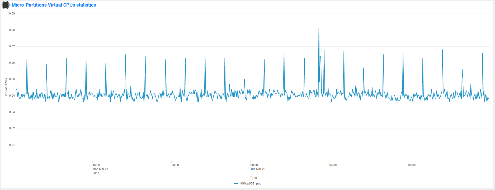

###############################
System footprint and benchmarks
###############################

===========================
What does cost the TA-nmon?
===========================

Before deploying the TA-nmon on your systems, you will want to know accurately what will be its costs in term of CPU, memory, and disk I/O.

Since the release 1.3.x of the TA-nmon, we have worked real hard to reduce it at the most, and good news, we got it minimal now!

**************************
Splunk Universal Forwarder
**************************

The TA-nmon needs off course the Splunk Universal Forwarder (or Splunk Enterprise!) to operate on top of it.

The Splunk Universal Forwarder is highly optimised to have the lowest level of costs in CPU and memory, on its own the Splunk Universal Forwarder has a very negligible foot print.

**Please consult the official Splunk Universal Forwarder documentation:** http://docs.splunk.com/Documentation/Forwarder/latest/Forwarder/Abouttheuniversalforwarder

*************
nmon binaries
*************

Depending on the operating system, the TA-nmon will start the nmon binary when required. (topas-nmon for AIX, nmon for Linux, sarmon for Solaris)

On its own, the resources foot print of the nmon binary is really very low, almost not detectable, its foot print is negligible.

*******
TA-nmon
*******

The TA-nmon does various processing tasks on the data being generated by nmon, this is where there are some risks of a CPU, memory and I/O foot print.

To avoid these risks, and limit at the maximum the amount of resources to be used, we implement fifo files, which allow controlling a constant volume of data to be proceeded.

**Thanks to this implementation, the TA-nmon foot print is now very low and constant, better charts than words, here are some benchmark operated on various systems:**

IBM AIX BENCHMARKS:
-------------------

**IBM AIX 6.1 ON POWER8 / Entitled 0.2 / VirtualCPUs 1:**

*date 27/03/2013, TA-nmon release 1.3.05, Splunk Universal Forwarder 6.5.2, Perl interpreter*

*lpar usage over 24 hours:*

*lpar usage_zoom over 24 hours:*

*Average I/O over 24 hours:*

*splunkd core CPU usage / Memory usage over 24 hours:*

**IBM AIX 7.1 ON POWER8 / Entitled 0.2 / VirtualCPUs 1:**

*date 27/03/2013, TA-nmon release 1.3.05, Splunk Universal Forwarder 6.5.2, Perl interpreter*

*lpar usage over 24 hours:*

*lpar usage_zoom over 24 hours:*

*Average I/O over 24 hours:*

*splunkd core CPU usage / Memory usage over 24 hours:*

**IBM AIX 7.2 ON POWER8 / Entitled 0.2 / VirtualCPUs 1:**

*date 27/03/2013, TA-nmon release 1.3.05, Splunk Universal Forwarder 6.5.2*

*lpar usage over 24 hours:*

.. image:: img/bench_AIX/AIX_72/lpar_full.png
   :alt: img/bench_AIX/AIX_72/lpar_full.png
   :align: center

*lpar usage_zoom over 24 hours:*

*Average I/O over 24 hours:*

*splunkd core CPU usage / Memory usage over 24 hours:*

LINUX BENCHMARKS:
-----------------

**SUSE Linux 11.4 BE (IBM POWER 8)**

*date 27/03/2013, TA-nmon release 1.3.05, Splunk Universal Forwarder 6.5.2, Perl interpreter, 1 CPU*

*CPU % usage over 24 hours:*

*Average I/O over 24 hours:*

*splunkd core CPU usage / Memory usage over 24 hours:*

**SUSE Linux 12.2 LE (IBM POWER 8)**

*date 27/03/2013, TA-nmon release 1.3.05, Splunk Universal Forwarder 6.5.2, Python interpreter, 1 CPU*

*CPU % usage over 24 hours:*

*Average I/O over 24 hours:*

*splunkd core CPU usage / Memory usage over 24 hours:*

**Red Hat Linux 6.9 BE (IBM POWER 8)**

*date 27/03/2013, TA-nmon release 1.3.05, Splunk Universal Forwarder 6.5.2, Perl interpreter, 1 CPU*

*CPU % usage over 24 hours:*

*Average I/O over 24 hours:*

*splunkd core CPU usage / Memory usage over 24 hours:*

**RedHat Linux 7.3 LE (IBM POWER 8)**

*date 27/03/2013, TA-nmon release 1.3.05, Splunk Universal Forwarder 6.5.2, Python interpreter, 1 CPU*

*CPU % usage over 24 hours:*

*Average I/O over 24 hours:*

*splunkd core CPU usage / Memory usage over 24 hours:*

**Ubuntu 16.04 LTS (IBM POWER 8)**

*date 27/03/2013, TA-nmon release 1.3.05, Splunk Universal Forwarder 6.5.2, Python interpreter, 1 CPU*

*CPU % usage over 24 hours:*

*Average I/O over 24 hours:*

*splunkd core CPU usage / Memory usage over 24 hours:*
