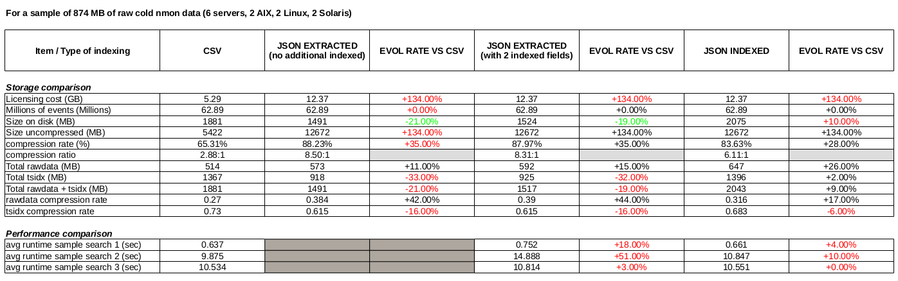
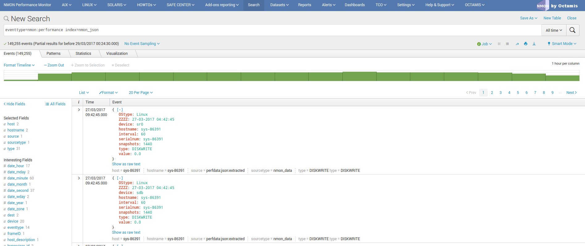

###############################
JSON indexing versus legacy CSV
###############################

Nmon data is basically generating CSV data (Comma Separated Value), and this is as well the case for the files generated by the TA-nmon

**By default, the TA-nmon generates several files to be indexed in the following directories:**

* $SPLUNK_HOME/var/log/nmon/var/csv_repository
* $SPLUNK_HOME/var/log/nmon/var/config_repository

In the case of the nmon performance data (the "csv_repository" 0, we generate one csv data file by nmon section. (basically per performance monitor)

Then, Splunk indexes the data using the CSV "INDEXED_EXTRACTIONS" mode, these parameters are visible in "default/props.conf" under the "nmon_data" sourcetype::

    [nmon_data]

    FIELD_DELIMITER=,
    FIELD_QUOTE="
    HEADER_FIELD_LINE_NUMBER=1

    # your settings
    INDEXED_EXTRACTIONS=csv

In this mode, Splunk identifies the fields name using the CSV header, then each field is indexed as an "indexed fields", to be opposed to fields extraction at search time. (like Key Value data for instance)

The indexed CSV mode provides great performances at search time, and CSV data generates a low level of data volume which saves Splunk licensing costs.

However, the disadvantage of this is an higher cost in storage requirements due to the volume of tsidx (indexes files) versus raw data, in comparison indexing other kind of data that can be fully extracted at search time. (like key value or json extracted data)

This is why we have introduced in the release 1.3.x a new optional mode that allows to generate the performance data (99.99% of the data volume) in JSON mode instead of legacy CSV data.

**LIMITATION:**

Currently, the JSON mode indexing is only available to the Python parser, if your hosts user Perl parser, this parameter will have no impact and CSV data will be generated.

===============================================
Comparison of CSV indexing versus JSON indexing
===============================================

There are advantages and disadvantages in both solutions, this is basically low licensing cost versus storage costs.

The following benchmark has been made on a set of nmon cold data, 3 months of data for 6 servers with an interval of 4 minutes between performance measures. (2 x AIX, 2 x Linux, 2 x Solaris)

Notes: This is a benchmark that operated on a Splunk standalone server, using cold data. This not necessary fully representative of what to expect in term of results depending on various factors.
It provides however a good vision, and results in real life should be closed enough.

As a conclusion, in JSON data we generate much more data (approximately x 2 volume), licensing costs are then significantly highers due to this factor.

But the lower volume of tsdix a better data compression ratio generates approximately 20% less of final storage costs.

There is a well a lower performance level, which could be even more significant at scale.

==========================
Ok, how to use JSON then ?
==========================

Activating JSON mode is very easy, all you need is activating the "--json_output" option in your own "local/nmon.conf":

**Create a "local/nmon.conf" and activate json mode:**::

   # Since the release 1.3.0, AIX and Linux OS use the fifo_consumer.sh script to consume data produced by the fifo readers
   # the following option allows specifying the options sent to the nmon2csv parsers

   # consult the documentation to get the full list of available options

   # --mode realtime --> explicitly manage realtime data (default)
   # --use_fqdn --> use the host fully qualified domain name
   # --json_output --> generate the performance data in json format instead of regular csv data

   nmon2csv_options="--mode realtime --json_output"

And deploy your new configuration.

At next parsing cycle, the data will be generate in JSON mode and transparently rewritten to the nmon_data sourcetype.

Et voila!

**Additional notes:**

For more coherence, and best index performances, I would recommend to store the JSON nmon data into a separated and dedicated index.
