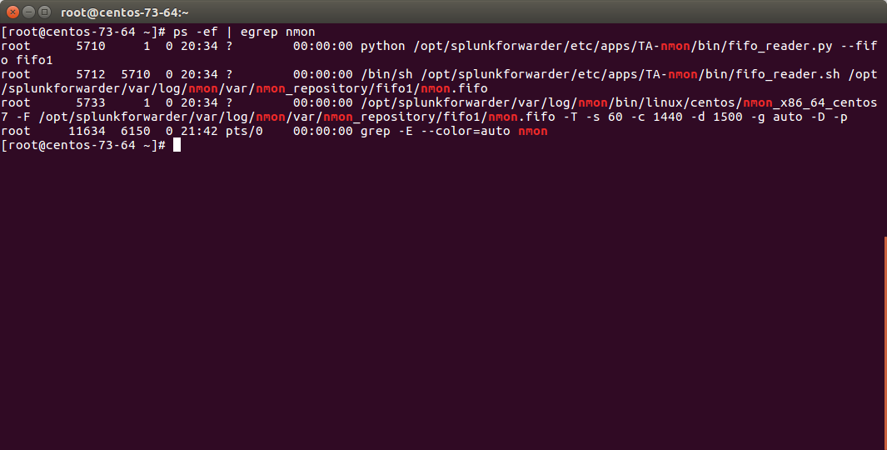
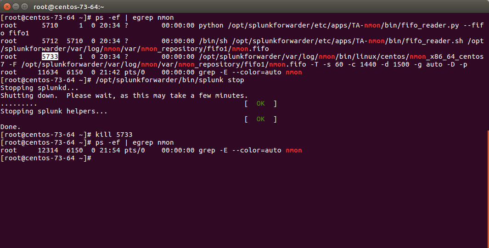
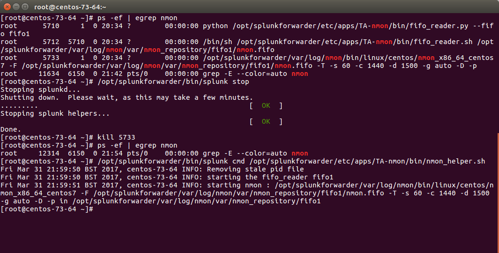
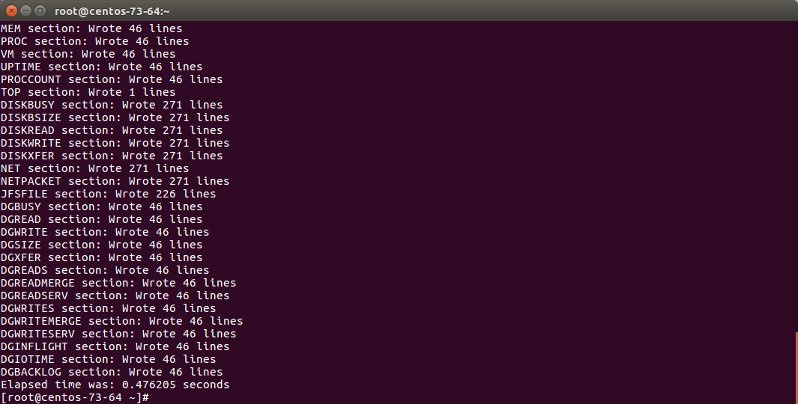
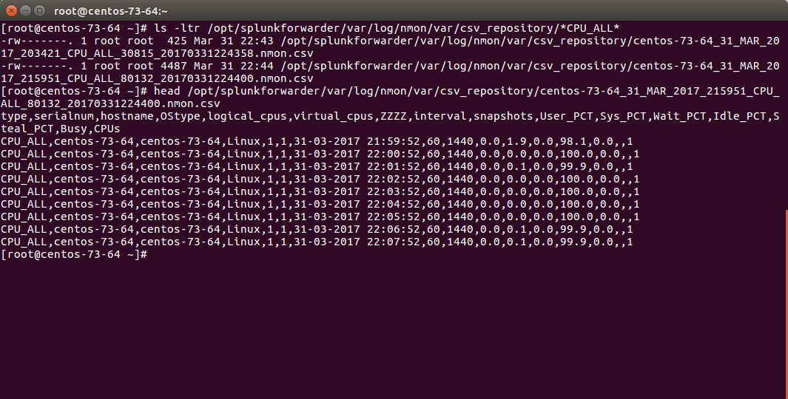
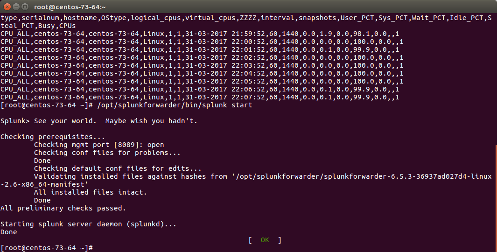
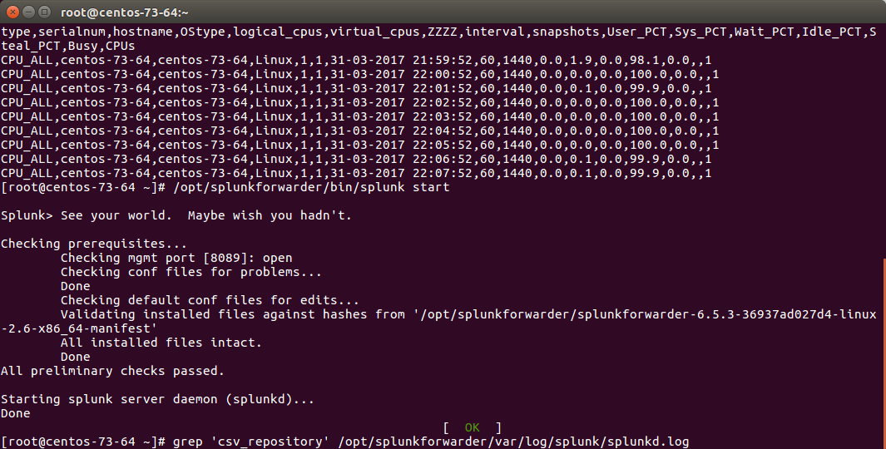
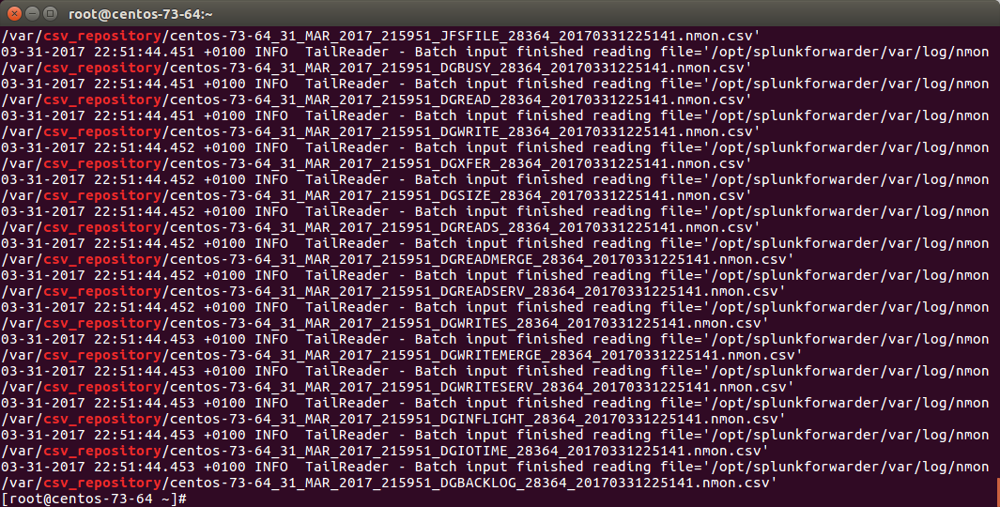

############
Troubleshoot
############

**There is a nice and complete troubleshoot guide in the Nmon Core application:**

http://nmon-for-splunk.readthedocs.io/en/latest/Userguide.html#troubleshooting-guide-from-a-to-z

In a nutshell:

==========================
Expected running processes
==========================

Since the 1.3.x branch, you should find various processes running:

* 1 x nmon process (or 2 x nmon processes during the parallel interval)
* 1 x main Perl or Python fifo_reader process (or 2 x processes during the parallel interval)
* 1 x subshell fifo_reader process (or 2 x processes during the parallel interval)

*On a Linux box:*

*On AIX, the nmon process will be called "topas-nmon"*

*On Solaris, the sarmon process will be called "sadc"*

==================
Starting processes
==================

If you run in trouble and want to troubleshoot the situation, the easiest approach is stopping Splunk, kill existing nmon process and run the tasks manually:

* Stop Splunk and kill the nmon process::

    ./splunk stop

You will observe that killing the nmon process will automatically terminate the fifo_reader.pl|.py and the subshell fifo_reader.sh.
This the expected behavior, and mandatory.

If the processes do not stop, then your problem became mine and please open an issue !

* Now we can manually starting the processes, example::

    /opt/splunkforwarder/bin/splunk cmd /opt/splunkforwarder/etc/apps/TA-nmon/bin/nmon_helper.sh

*Please adapt the paths to your context*

**Let's summarize what happened here:**

* nmon_helper.sh starts the fifo reader, if there is no fifo_reader running, the "fifo1" process will be started
* the fifo_reader.pl|.py starts a fifo_reader.sh process in the background
* nmon_helper.sh starts the nmon process which will write its data to the relevant fifo file
* the nmon process cannot start if the fifo_reader has not started

If something unexpected happens and that the fifo_reader and nmon process do not start normally, you may want to trouble shoot the nmon_helper.sh script.

You can do very easily by commenting out "# set -x", re-run the script and analyse the output. (you might need to add the set-x within the functions as well)

==============================
Checking fifo_reader processes
==============================

The fifo_reader processes will continuously read the fifo file writen by the nmon process, and generate various dat files that represent the different typologies of nmon data:

.. image:: img/troubleshoot4.png
   :alt: troubleshoot4.png
   :align: center

**How this it work?**

* The fifo_reader.sh reads every new line of data writen to the fifo file (named pipe) and sends the data to the fifo_reader.pl|.py
* The fifo_reader.pl|.py parses the lines and applies various regular expressions to decide where to write the data, depending on its content
* If there were existing *.dat files at the startup of the fifo_reader processes, those dat files are rotated and renamed to "*.rotated"
* The nmon.fifo is not regular file but a named pipe (observe the "prw-------"), its size will always be equal to 0

=========================
Checking the data parsing
=========================

**The parsing of those dat files is being achieved in 2 main steps:**

* The "bin/fifo_consumer.sh" script is started every 60 seconds by Splunk
* This script will check if an nmon_data.dat file exists and that its size is greater than 0
* If the size of the nmon_dat.data file equals to 0, then the fifo_consumer.sh has nothing to do and will exit this fifo file
* If the size is greater than 0 but its modification time (mtime) is less than 5 seconds, the script will loop until the condition is true
* The fifo_consumer.sh reads the dat file, recompose the nmon file and stream its content to the "bin/nmon2csh.sh" shell wrapper
* After this operation, the nmon_data.dat file will be empty for the next cycle
* The shell wrapper reads in stdin the data, and send it to the nmon2csv parser (bin/nmon2csv.pl|.py)
* The parser reads the nmon data, parses it and produces the final files to be indexed by Splunk

Easy no ;-)

You can easily run the fifo_consumer.sh manually::

    /opt/splunkforwarder/bin/splunk cmd /opt/splunkforwarder/etc/apps/TA-nmon/bin/fifo_consumer.sh

The files to be indexed by Splunk can be found in::

    $SPLUNK_HOME/var/log/nmon/var/csv_repository
    $SPLUNK_HOME/var/log/nmon/var/config_repository
    $SPLUNK_HOME/var/log/nmon/var/json_repository

Example:

========================
Checking Splunk indexing
========================

Splunk monitors those directories in "batch" mode, which means index and delete.

**Once you will have restarted Splunk, all the files will be consumed and disappear in a few seconds:**

Et voila!
